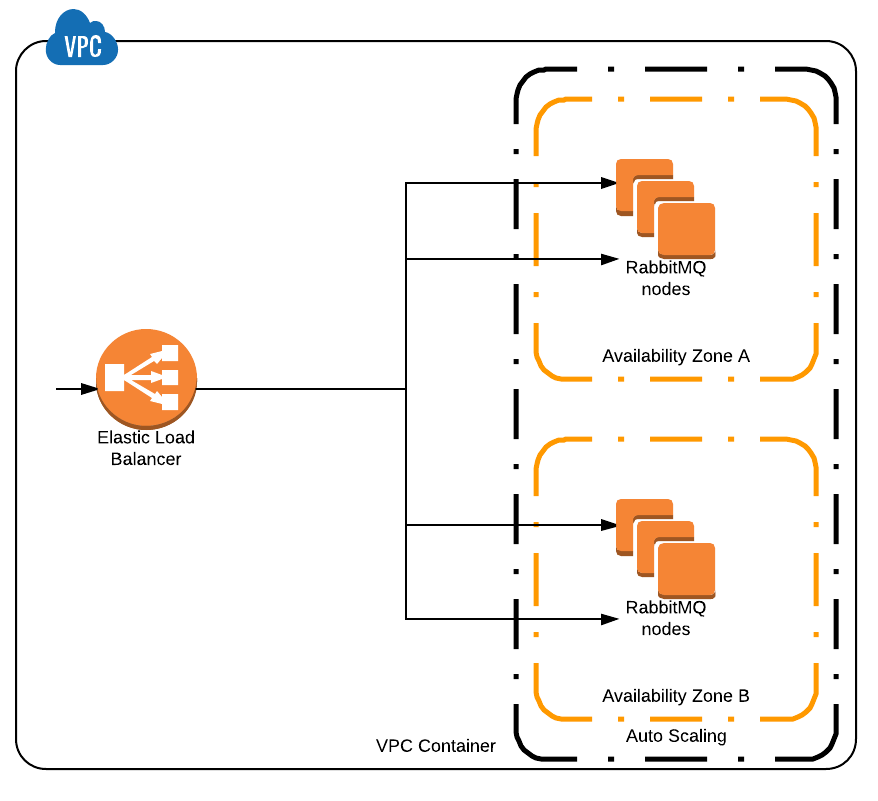

# Dead simple Terraform configuration for creating RabbitMQ cluster on AWS.

## What it does ?

1. Uses [official](https://hub.docker.com/_/rabbitmq/) RabbitMQ docker image.
1. Creates `N` nodes in `M` subnets
1. Creates Autoscaling Group and ELB to load balance nodes
1. Makes sure nodes can talk to each other and create cluster
1. Make sure new nodes always join the cluster
1. Configures `/` vhost queues in High Available (Mirrored) mode with automatic synchronization (`"ha-mode":"all", "ha-sync-mode":"3"`)


<p align="center">

</p>


## How to use it ?
Copy and paste into your Terraform configuration:
```
module "rabbitmq" {
  source                            = "git::https://github.com/ceibo-it/terraform-aws-rabbitmq.git?ref=tags/0.0.1"
  vpc_id                            = var.vpc_id
  ssh_key_name                      = var.ssh_key_name
  subnet_ids                        = var.subnet_ids
  elb_additional_security_group_ids = var.cluster_security_group_id
  min_size                          = "3"
  max_size                          = "3"
  desired_size                      = "3"
}
```

then run `terraform init`, `terraform plan` and `terraform apply`.

Are 3 node not enough ? Update sizes to `5` and run `terraform apply` again,
it will update Autoscaling Group and add `2` nodes more. Dead simple.

Node becomes unresponsive ? Autoscaling group and ELB Health Checks will automatically replace it with new one, without data loss.

Note: The VPC must have `enableDnsHostnames` = `true` and `enableDnsSupport` = `true` for the private DNS names to be resolvable for the nodes to connect to each other.   


## NOTICE

terraform-aws-rabbitmq
Copyright 2020 Ceibo


This product includes software developed by
Ulam Labs, (https://github.com/ulamlabs/terraform-aws-rabbitmq)
Licensed under MIT License
Copyright (c) 2019 Ulam Labs
